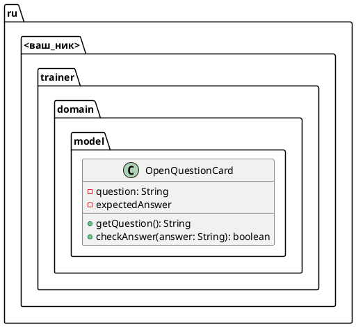

# Задание 2.1
Добавить класса-модель и покрыть его тестами

## Техническое описание
### Архитектура
#### Диаграмма классов

- Поля `question` и `expectedAnswer` - обязательны и неизменяемы в ходе работы программы
- Поле `question` доступно снаружи через `getter`
- Поле `expectedAnswer` снаружи недоступно
- Для проверки ответа используется метод `checkAnswer`, принимающий ответ, введенных пользователем

## Критерии приема
- Класс `OpenQuestionCard` создан в пакете `ru.<ваш_ник>.trainer.domain.model`
- Все поля имеют модификатор доступа `private`
- Обязательные поля задаются через конструктор класса
- В случае передачи невалидных данных, выбрасывается исключение `IllegalArgumentException` с понятным текстом
- Покрыть юнит-тестами
  - создание класса
  - вызов `checkAnswer`

## Подсказки
- Для создание пакетов `domain.model`, нужно нажать правой кнопкой на пакете `ru.<ваш_ник>` и выбрать `New`, `Package`
- Для создания юнит-теста можно
  - Открыть наш класс `OpenQuestionCard`
  - нажать правой кнопкой на названии класса в редакторе кода
  - в появившемся меню выбирать `Generate`
  - выбирать `Test`
  - в появившемся окне проверить, что стоит `JUnit5` и нажать `Ok`
  - проверить, что класс сгенерировался в `src/test/ru....domain.model`