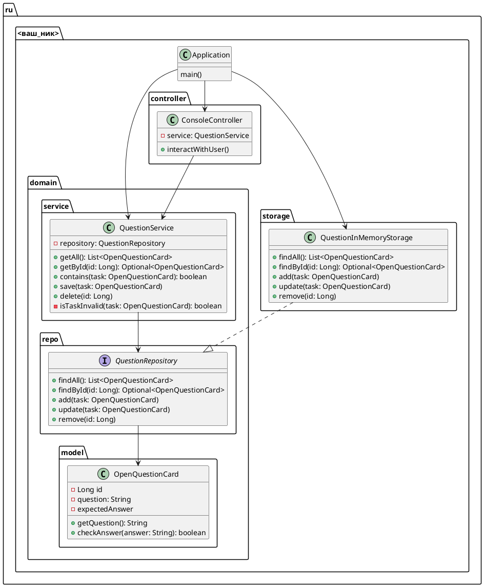

# Задание 3.1

В соответствии со слоеной архитектурой, добавить:

- в слой бизнес-логики
  
  - репозиторий
  
  - сервис

- в слой данных
  
  - реализацию репозитории

- в слой представления
  
  - контроллер для взаимодействия с пользователем

- в Application - соеденить все вместе и осуществить запуск

## Техническое описание

### Архитектура

#### Диаграмма классов

- В классе-моделе появилось поле `id` типа `Long`, являющийся уникальным идентификатором в системе

## Критерии приема

- Классы реализованы в соответствии со схемой
- Компоненты связываются через контекст Spring
- Не нарушаются прицнипы SOLID, KISS, прочие
- Изменения должны быть закоммичены в ветку `hw1`
- Если еще не сделан Pull Request из `hw1` в `master`, сделать
- Прислать ссылку на Pull Request
- После получения Approve-а задание будет считаться выполненным