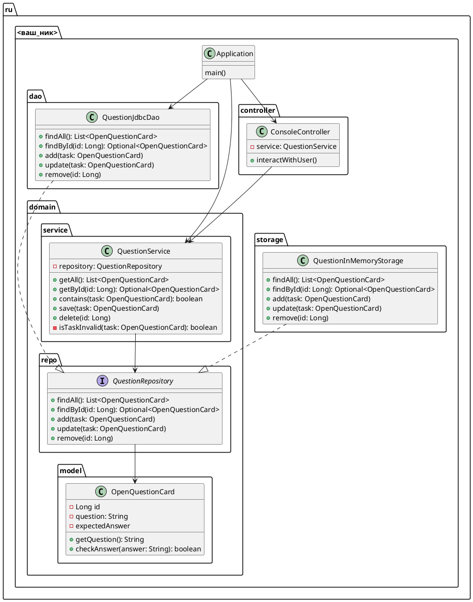

# Задание 4.1

Добавить реализацию репозитория на базе JDBC и настроить DataSource в контексте Spring

## Техническое описание

### Архитектура

#### Диаграмма классов

## Критерии приема

- В контексте Spring добавлен DataSource
- Добавлена реализация репозитория на JDBC
- У реализации репозитория не нарушаются принципы SOLID, KISS и пр.
